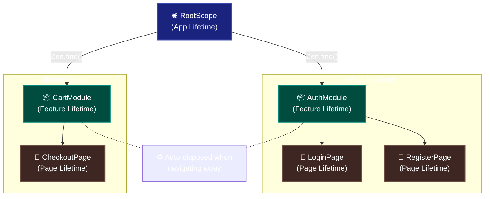
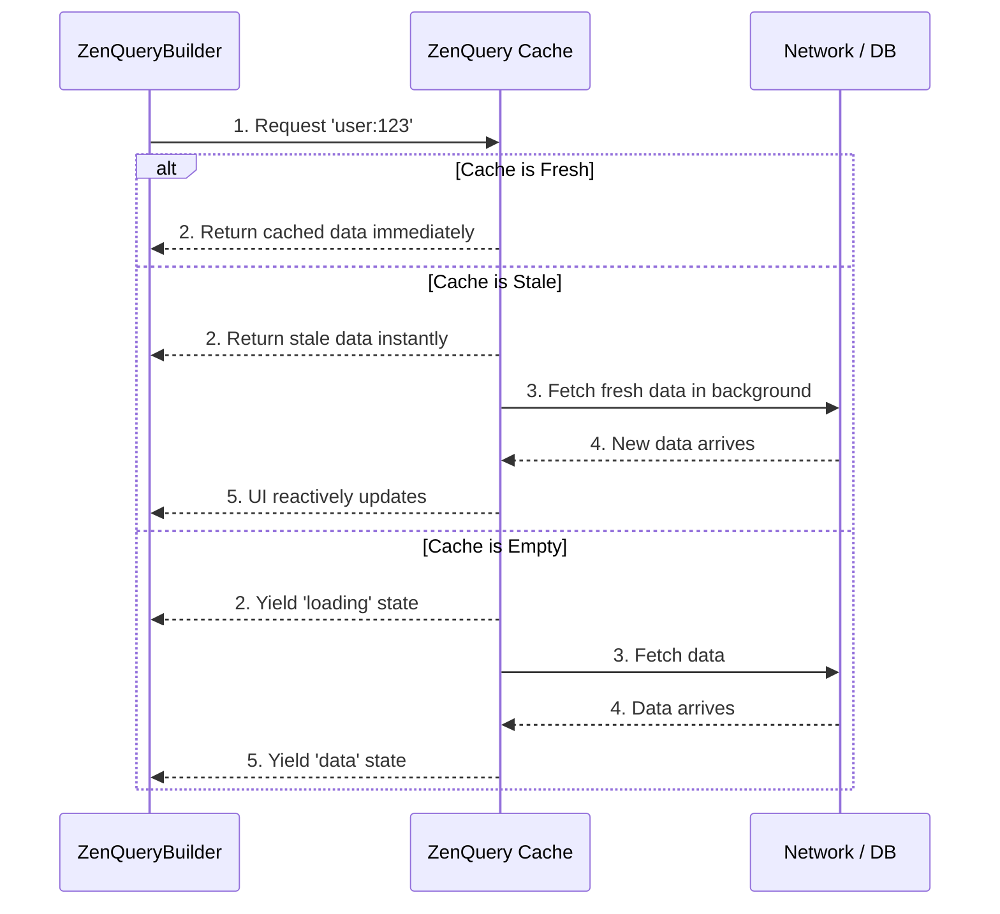

<div align="center">
  <h1>Zenify</h1>
  <p><b>Hierarchical DI • Zero-Boilerplate Reactivity • Smart Async State</b></p>
</div>

[](https://pub.dev/packages/zenify)
[](https://pub.dev/packages/zenify/score)
[](https://pub.dev/packages/zenify/score)
[](https://codecov.io/gh/sdegenaar/zenify)
[](https://opensource.org/licenses/MIT)

**Complete state management for Flutter — hierarchical dependency injection, reactive programming, and intelligent async state. Zero boilerplate, automatic cleanup.**

```dart
// Hierarchical DI with automatic cleanup
scope.put<UserService>(UserService());
final service = scope.find<UserService>()!;

// Reactive state that just works
final count = 0.obs();
ZenObserver(() => Text('${count.value}'))  // Auto-rebuilds

// Infinite scroll — automatic page management
final feed = ZenInfiniteQuery<PostPage>(
  queryKey: 'feed',
  initialPageParam: 1,
  infiniteFetcher: (page, _) => api.getPosts(page: page),
  getNextPageParam: (lastPage, all) => lastPage.hasMore ? all.length + 1 : null,
);

feed.fetchNextPage();             // append next page
feed.hasNextPage.value            // know when to stop
feed.isFetchingNextPage.value     // drive your loading footer
feed.data.value                   // all pages, reactive
```

---

## 🎯 Why Zenify?

Building async-heavy Flutter apps? You're probably fighting:

- **Manual cache management** — Writing the same cache logic over and over
- **Duplicate API calls** — Multiple widgets fetching the same data
- **Memory leaks** — Forgetting to dispose controllers and subscriptions
- **Boilerplate overload** — Hundreds of lines for simple async state

**Zenify solves all of this.**

---

## ⚡ What Makes Zenify Different

### Hierarchical Scoped Architecture
Riverpod-inspired scoping with **automatic cleanup**. Dependencies flow naturally from parent to child, and scopes dispose themselves automatically when no longer needed. Simple API: `Zen.put()`, `Zen.find()`, `Zen.delete()`.

### Zero Boilerplate Reactivity
Reactive system with `.obs()` and `ZenObserver()` (or `Obx()` for GetX users). Write less, accomplish more, keep your code clean. Built on Flutter's `ValueNotifier` for optimal performance.

### React Query Style Async State
A native-inspired implementation of **TanStack Query patterns**: automatic caching, smart refetching, request deduplication, and stale-while-revalidate — built on top of the reactive system.

### Offline-First Resilience
Don't let network issues break your app. Zenify includes **robust persistence**, an **offline mutation queue**, and **optimistic updates** out of the box with minimal configuration.

---

> **Coming from GetX?** The reactive system (`.obs()`, `Obx()`), controller lifecycle, and DI verbs are intentionally familiar. Most migration is mechanical.
> [GetX Migration Guide →](https://github.com/sdegenaar/zenify/blob/main/doc/migration_guide.md)

> **Upgrading from V1?** The only mechanical change is adding a `controller` parameter to every `ZenView.build()` override.
> [V2 Migration →](#-migrating-from-v1)

---

## 🏗️ Understanding Scopes (The Foundation)

Zenify organizes dependencies into **three hierarchical levels** with automatic lifecycle management. When a parent scope is destroyed, all its children are automatically cleaned up — zero memory leaks.



### The Three Scope Levels

**RootScope (Global — App Lifetime)**
- Services like `AuthService`, `CartService`, `ThemeService`
- Lives for entire app session
- Access anywhere via `Zen.find<CartService>()` or the `.to` pattern: `CartService.to.addItem()`

**Module Scope (Feature — Feature Lifetime)**
- Controllers shared across feature pages
- Auto-dispose when leaving feature
- Example: HR feature with `CompanyController` → `DepartmentController` → `EmployeeController`

**Page Scope (Page — Page Lifetime)**
- Page-specific controllers
- Auto-dispose when page pops
- Example: `LoginController`, `ProfileFormController`

### When to Use What

| Scope | Use For | Lifetime |
|-------|---------|----------|
| **RootScope** | Needed across entire app | App session |
| **Module Scope** | Needed across a feature | Feature navigation |
| **Page Scope** | Needed on one page | Single page |

[Learn more about hierarchical scopes →](https://github.com/sdegenaar/zenify/blob/main/doc/hierarchical_scopes_guide.md)

---

## 🚀 Quick Start (30 seconds)

### 1. Install

```yaml
dependencies:
  zenify: ^2.0.0
```

### 2. Initialize

```dart
void main() {
  Zen.init();
  runApp(const MyApp());
}
```

### 3. Create a Controller

```dart
class CounterController extends ZenController {
  final count = 0.obs();
  void increment() => count.value++;
}
```

### 4. Provide & Build

```dart
// Provide the controller to the page via ZenScopeWidget
ZenScopeWidget.create<CounterController>(
  create: () => CounterController(),
  child: const CounterPage(),
)

// Consume it — controller is injected directly into build()
class CounterPage extends ZenView<CounterController> {
  const CounterPage({super.key});

  @override
  Widget build(BuildContext context, CounterController controller) {
    return Scaffold(
      body: Center(
        child: Column(
          mainAxisAlignment: MainAxisAlignment.center,
          children: [
            ZenObserver(() => Text('Count: ${controller.count.value}')),
            ElevatedButton(
              onPressed: controller.increment,
              child: const Text('Increment'),
            ),
          ],
        ),
      ),
    );
  }
}
```

**That's it!** Fully reactive with automatic cleanup. No `setState`, no manual disposal, no memory leaks.

[See complete example →](example/counter)

---

## 🔥 Core Features

### 1. ZenView — Pages & Screens

V2 injects the controller as an explicit parameter to `build()`. The compiler enforces correctness and multi-instance isolation is structural.

**Pattern A — Scope-provided (recommended for pages)**

```dart
// Route provides the controller via ZenScopeWidget:
ZenScopeWidget.create<CartController>(
  create: () => CartController(),
  child: const CartPage(),
)

// Page just consumes it:
class CartPage extends ZenView<CartController> {
  const CartPage({super.key});

  @override
  Widget build(BuildContext context, CartController controller) {
    return Text('${controller.totalItems} items');
  }
}
```

**Pattern B — Self-owned controller (for list items, cards, per-instance widgets)**

Use `initController` when the widget needs constructor parameters from itself (e.g., a `messageId`). The controller is owned, scoped, and auto-disposed with the widget:

```dart
class VoiceMessageView extends ZenView<VoiceMessageController> {
  final String messageId;
  final String messagePath;
  const VoiceMessageView({
    required this.messageId,
    required this.messagePath,
    super.key,
  });

  @override
  VoiceMessageController Function() get initController => () =>
      VoiceMessageController(messageId: messageId, messagePath: messagePath);

  @override
  Widget build(BuildContext context, VoiceMessageController controller) {
    return Slider(value: controller.progress.value, onChanged: (_) {});
  }
}
```

**Which to use?**

| Situation | Pattern |
|---|---|
| Page/screen, controller is app-wide or feature-scoped | `ZenScopeWidget.create` + `ZenView` |
| List-item or card widget with per-instance state | `initController` override |
| Multiple identical views on screen simultaneously | Both work — each gets its own controller |

### 2. Hierarchical DI with Auto-Cleanup

Organize dependencies naturally with **feature-based modules** and parent-child scopes.

```dart
// App-level services (persistent)
class AppModule extends ZenModule {
  @override
  void register(ZenScope scope) {
    scope.put<AuthService>(AuthService(), isPermanent: true);
    scope.put<DatabaseService>(DatabaseService(), isPermanent: true);
  }
}

// Feature-level controllers (auto-disposed on navigation)
class UserModule extends ZenModule {
  @override
  void register(ZenScope scope) {
    final db = scope.find<DatabaseService>()!;
    scope.putLazy<UserRepository>(() => UserRepository(db));
    scope.putLazy<UserController>(() => UserController());
  }
}

// Use with any router — it's just a widget
ZenRoute(
  moduleBuilder: () => UserModule(),
  page: const UserPage(),
  scopeName: 'UserScope',
)
```

**Core API:**
- `Zen.put<T>()` — Register in root scope
- `Zen.find<T>()` — Retrieve (throws if missing)
- `Zen.get<T>()` — Alias for find
- `Zen.has<T>()` — Check existence
- `Zen.delete<T>()` / `Zen.remove<T>()` — Remove

**Works with:** GoRouter, AutoRoute, Navigator 2.0, any router.

[See Hierarchical Scopes Guide →](https://github.com/sdegenaar/zenify/blob/main/doc/hierarchical_scopes_guide.md)

### 3. Zero-Boilerplate Reactivity

GetX-inspired reactive system built on Flutter's `ValueNotifier`. Simple, fast, no magic.

```dart
class TodoController extends ZenController {
  final todos = <Todo>[].obs();
  final filter = Filter.all.obs();

  List<Todo> get filteredTodos {
    switch (filter.value) {
      case Filter.active: return todos.where((t) => !t.done).toList();
      case Filter.completed: return todos.where((t) => t.done).toList();
      default: return todos.toList();
    }
  }

  void addTodo(String title) => todos.add(Todo(title));
}

// In UI — automatic, minimal rebuilds
ZenObserver(() => Text('${controller.todos.length} todos'))
ZenObserver(() => ListView.builder(
  itemCount: controller.filteredTodos.length,
  itemBuilder: (context, i) => TodoItem(controller.filteredTodos[i]),
))
```

**For manual/selective rebuilds**, use `ZenUpdater`:

```dart
// Controller:
controller.update(['counter']); // Only notifies 'counter' listeners

// Widget:
ZenUpdater<CounterController>(
  id: 'counter',
  builder: (context, ctrl) => Text('${ctrl.count}'),
)
```

[See Reactive Core Guide →](https://github.com/sdegenaar/zenify/blob/main/doc/reactive_core_guide.md)

### 4. Smart Async State (ZenQuery)

React Query patterns built on the reactive system. Say goodbye to manual `isLoading` flags.



**Path A — Inline (no controller needed):**
```dart
ZenQueryConsumer<User>(
  queryKey: 'user:123',
  fetcher: (_) => api.getUser(123),
  data: (user) => UserProfile(user),
  loading: () => const CircularProgressIndicator(),
  error: (error, retry) => ErrorView(error, onRetry: retry),
);
```

**Path B — Shared (query in controller, multiple widgets read it):**
```dart
class UserController extends ZenController {
  late final query = ZenQuery<User>(
    queryKey: 'user:123',
    fetcher: (_) => api.getUser(123),
    config: ZenQueryConfig(staleTime: Duration(minutes: 5)),
  );
}

ZenQueryBuilder<User>(
  query: controller.query,
  builder: (context, user) => UserProfile(user),
  loading: () => const CircularProgressIndicator(),
  error: (error, retry) => ErrorView(error, onRetry: retry),
);
```

**What you get for free:**
- ✅ Automatic caching with configurable staleness
- ✅ Smart deduplication (same key = one request)
- ✅ Background refetch on focus/reconnect
- ✅ Stale-while-revalidate
- ✅ Optimistic updates with rollback
- ✅ Infinite scroll pagination
- ✅ Real-time streams support
- ✅ Tag & wildcard group invalidation

[See ZenQuery Guide →](https://github.com/sdegenaar/zenify/blob/main/doc/zen_query_guide.md)

### 5. Offline Synchronization Engine

```dart
// Auto-persist data to disk
final postsQuery = ZenQuery<List<Post>>(
  queryKey: 'posts',
  fetcher: (_) => api.getPosts(),
  config: ZenQueryConfig(
    persist: true,
    networkMode: NetworkMode.offlineFirst,
  ),
);

// Queue mutations when offline — auto-replay when back online
final createPost = ZenMutation<Post, Post>(
  mutationKey: 'create_post',
  mutationFn: (post) => api.createPost(post),
);
```

**Key capabilities:**
- **Storage agnostic** — Hive, SharedPreferences, SQLite, or any `ZenStorage` implementation
- **Mutation queue** — Actions queued and auto-replayed on reconnect
- **Optimistic updates** — Update UI immediately, sync later
- **Network modes** — Control how queries behave offline

[See Offline Guide →](https://github.com/sdegenaar/zenify/blob/main/doc/offline_guide.md)

---

## 💡 Common Patterns

### Global Services with `.to` Pattern

```dart
class CartService extends ZenService {
  static CartService get to => Zen.find<CartService>();

  final items = <CartItem>[].obs();
  void addToCart(Product product) => items.add(CartItem.fromProduct(product));
}

// Register once at startup
Zen.put<CartService>(CartService(), isPermanent: true);

// Use anywhere — widgets, controllers, helpers
CartService.to.addToCart(product);
```

### Infinite Scroll Pagination

```dart
final postsQuery = ZenInfiniteQuery<PostPage>(
  queryKey: ['posts'],
  infiniteFetcher: (cursor, token) => api.getPosts(cursor: cursor),
);

// Auto-load next page when reaching end
if (index == postsQuery.data.length - 1) postsQuery.fetchNextPage();
```

### Optimistic Updates

```dart
// Easy way — helpers handle rollback automatically
final createPost = ZenMutation.listPut<Post>(
  queryKey: 'posts',
  mutationFn: (post) => api.createPost(post),
  onError: (err, post) => logger.error('Create failed', err),
);

// Advanced — full control
final mutation = ZenMutation<User, UpdateArgs>(
  onMutate: (args) => userQuery.data.value = args.toUser(),
  onError: (err, args, old) => userQuery.data.value = old,
);
```

### Real-Time Streams

```dart
final chatQuery = ZenStreamQuery<List<Message>>(
  queryKey: 'chat',
  streamFn: () => chatService.messagesStream,
);
```

---

## 🛠️ Advanced Features

- **Effects** — Automatic loading/error/success state management ([guide](https://github.com/sdegenaar/zenify/blob/main/doc/effects_usage_guide.md))
- **Workers** — `ever`, `debounce`, `throttle`, `interval`, `condition` reactive handlers
- **Computed values** — Auto-updating derived state
- **Performance control** — Fine-grained: `ZenObserver` (reactive) or `ZenUpdater` (manual)
- **DevTools** — Built-in scope/query inspector

---

## 📱 Widget Quick Reference

| Widget | Use When | Rebuilds On |
|--------|----------|-------------|
| **ZenView** | Building pages with controllers | Controller injected into `build()` |
| **ZenRoute** | Need module/scope per route | Route navigation |
| **ZenObserver** / **Obx** | Fine-grained reactive updates | `.obs()` value changes |
| **ZenUpdater** | Manual control over rebuild timing | `controller.update()` call |
| **ZenConsumer** | Access a controller, no rebuild | Never (manual) |
| **ZenQueryConsumer** | Fetch data inline, no controller needed | Query state changes |
| **ZenQueryBuilder** | Shared query instance across widgets | Query state changes |
| **ZenStreamQueryBuilder** | Real-time data streams | Stream events |
| **ZenEffectBuilder** | Async operations with loading/error states | Effect state changes |

**90% of the time, you'll use:**
- `ZenView` for pages
- `ZenObserver` for reactive UI
- `ZenQueryConsumer` for simple API calls
- `ZenQueryBuilder` when the query is shared across widgets

---

## 🔧 Configuration

```dart
void main() {
  Zen.init();

  // Optional: configure logging
  ZenConfig.applyEnvironment(ZenEnvironment.development);

  // Optional: set global query defaults
  Zen.queryCache.setDefaultConfig(ZenQueryConfig(
    staleTime: Duration(minutes: 5),
    cacheTime: Duration(hours: 1),
  ));

  runApp(const MyApp());
}
```

---

## 🧪 Testing

Built for testing from the ground up:

```dart
void main() {
  setUp(() {
    Zen.testMode().clearQueryCache();
  });
  tearDown(() => Zen.reset());

  test('counter increments', () {
    final controller = CounterController();
    controller.onInit();
    controller.increment();
    expect(controller.count.value, 1);
    controller.dispose();
  });

  test('mock dependencies', () {
    Zen.testMode().mock<ApiClient>(FakeApiClient());
    // All code that calls Zen.find<ApiClient>() gets the mock
  });

  test('query with in-memory storage', () async {
    Zen.queryCache.setStorage(InMemoryStorage()); // built-in, zero deps
    final q = ZenQuery<String>(
      queryKey: 'test',
      fetcher: (_) async => 'hello',
      config: ZenQueryConfig(persist: true, toJson: (s) => {'v': s}, fromJson: (j) => j['v']),
    );
    await q.fetch();
    expect(q.data.value, 'hello');
  });
}
```

[See complete testing guide →](https://github.com/sdegenaar/zenify/blob/main/doc/testing_guide.md)

---

## ⬆️ Migrating from V1

V2 has **one breaking change**: `ZenView.build()` now receives the controller as an explicit parameter.

```dart
// V1
class CartPage extends ZenView<CartController> {
  @override
  Widget build(BuildContext context) {
    return Text('${controller.totalItems}'); // magic getter — gone
  }
}

// V2
class CartPage extends ZenView<CartController> {
  const CartPage({super.key});

  @override
  Widget build(BuildContext context, CartController controller) {
    return Text('${controller.totalItems}'); // explicit, compiler-enforced
  }
}
```

**Other changes:**

| V1 | V2 | Notes |
|---|---|---|
| `createController` override | `initController` override | Renamed for clarity |
| `ZenBuilder` | `ZenUpdater` | `ZenBuilder` is a deprecated alias — still compiles |
| `ZenControllerScope` | `ZenScopeWidget.create<T>()` | Deprecated alias still compiles |
| `controller` magic getter | `controller` parameter in `build()` | Compiler-enforced |

[Full V2 Migration Guide →](https://github.com/sdegenaar/zenify/blob/main/doc/migration_guide.md)

---

## 🔍 Flutter DevTools Extension

Zenify has a separate DevTools extension package for real-time inspection and debugging.

### Quick Setup

```yaml
dev_dependencies:
  zenify_devtools_extension: ^1.0.0
```

```dart
void main() {
  Zen.init(registerDevTools: true); // registers extensions automatically
  runApp(const MyApp());
}
```

**3-Tab Inspector:**
1. **Scope Inspector** — Visualize your entire DI hierarchy
2. **Query Cache Viewer** — Monitor, refetch, and invalidate queries
3. **Metrics Dashboard** — Live metrics to identify bottlenecks

[Learn more →](https://pub.dev/packages/zenify_devtools_extension)

---

## 🎓 Learning Path

**New to Zenify?** Start here:

1. **5 minutes**: [Counter Example](example/counter) — Basic reactivity
2. **10 minutes**: [Todo Example](example/todo) — CRUD with effects
3. **15 minutes**: [ZenQuery Guide](https://github.com/sdegenaar/zenify/blob/main/doc/zen_query_guide.md) — Async state management
4. **20 minutes**: [E-commerce Example](example/ecommerce) — Real-world patterns
5. **30 minutes**: [Offline Demo](example/zen_offline) — Full offline-first app

**Building something complex?**
- [Hierarchical Scopes Guide](https://github.com/sdegenaar/zenify/blob/main/doc/hierarchical_scopes_guide.md) — Advanced DI
- [State Management Patterns](https://github.com/sdegenaar/zenify/blob/main/doc/state_management_patterns.md) — Architecture
- [Testing Guide](https://github.com/sdegenaar/zenify/blob/main/doc/testing_guide.md) — Unit, widget, integration

---

## 📚 Complete Documentation

### Core Guides
- [Reactive Core Guide](https://github.com/sdegenaar/zenify/blob/main/doc/reactive_core_guide.md)
- [ZenQuery Guide](https://github.com/sdegenaar/zenify/blob/main/doc/zen_query_guide.md)
- [Offline-First Guide](https://github.com/sdegenaar/zenify/blob/main/doc/offline_guide.md)
- [Effects Guide](https://github.com/sdegenaar/zenify/blob/main/doc/effects_usage_guide.md)
- [Hierarchical Scopes](https://github.com/sdegenaar/zenify/blob/main/doc/hierarchical_scopes_guide.md)
- [State Management Patterns](https://github.com/sdegenaar/zenify/blob/main/doc/state_management_patterns.md)
- [Testing Guide](https://github.com/sdegenaar/zenify/blob/main/doc/testing_guide.md)
- [GoRouter Integration](https://github.com/sdegenaar/zenify/blob/main/doc/gorouter_guide.md)
- [GetX Migration Guide](https://github.com/sdegenaar/zenify/blob/main/doc/migration_guide.md)

### Examples
- [Counter](example/counter) — Simple reactive state
- [Todo App](example/todo) — CRUD operations
- [E-commerce](example/ecommerce) — Real-world patterns
- [Hierarchical Scopes Demo](example/hierarchical_scopes) — Advanced DI
- [ZenQuery Demo](example/zen_query) — Async state management
- [Offline Demo](example/zen_offline) — Full offline-first app
- [Showcase](example/zenify_showcase) — All features

---

## 🙏 Inspired By

- **[GetX](https://pub.dev/packages/get)** by Jonny Borges — For intuitive reactive patterns
- **[Riverpod](https://pub.dev/packages/riverpod)** by Remi Rousselet — For hierarchical scoping
- **[React Query](https://tanstack.com/query)** by Tanner Linsley — For smart async state

---

## 💬 Community & Support

- **Found a bug?** [Report it](https://github.com/sdegenaar/zenify/issues)
- **Have an idea?** [Discuss it](https://github.com/sdegenaar/zenify/discussions)
- **Need help?** Check our [documentation](https://github.com/sdegenaar/zenify/tree/main/doc)

---

## 📄 License

MIT License — see [LICENSE](LICENSE) file

---

## 🚀 Ready to Get Started?

```bash
flutter pub add zenify
```

**Choose your path:**
- New to Zenify? → [5-minute Counter Tutorial](example/counter)
- Want async superpowers? → [ZenQuery Guide](https://github.com/sdegenaar/zenify/blob/main/doc/zen_query_guide.md)
- Need offline support? → [Offline Guide](https://github.com/sdegenaar/zenify/blob/main/doc/offline_guide.md)
- Using GoRouter? → [GoRouter Integration](https://github.com/sdegenaar/zenify/blob/main/doc/gorouter_guide.md)
- Coming from GetX? → [Migration Guide](https://github.com/sdegenaar/zenify/blob/main/doc/migration_guide.md)
- Upgrading from V1? → [V2 Migration](#️-migrating-from-v1)
- Building something complex? → [Hierarchical Scopes Guide](https://github.com/sdegenaar/zenify/blob/main/doc/hierarchical_scopes_guide.md)
- Setting up tests? → [Testing Guide](https://github.com/sdegenaar/zenify/blob/main/doc/testing_guide.md)

**Experience the zen of Flutter development.**