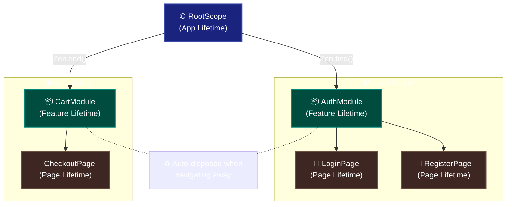
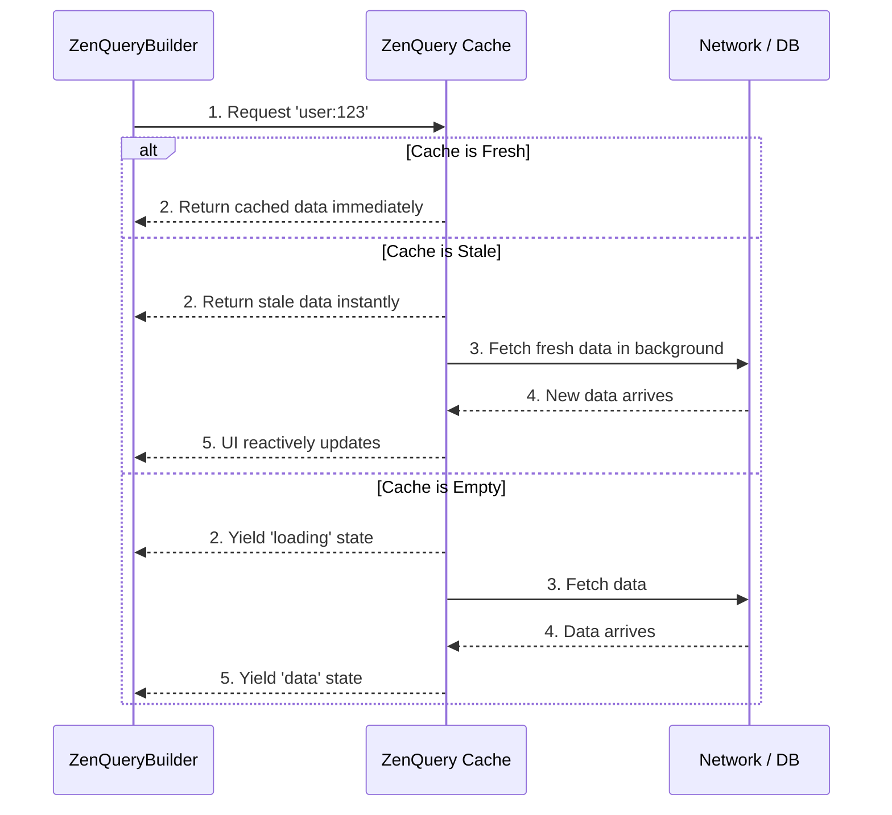

<div align="center">
  <h1>Zenify</h1>
  <p><b>TanStack Query Patterns • Hierarchical Scoped DI • Offline-First Architecture • Zero Code Generation</b></p>
</div>

[](https://pub.dev/packages/zenify)
[](https://pub.dev/packages/zenify/score)
[](https://pub.dev/packages/zenify/score)
[](https://codecov.io/gh/sdegenaar/zenify)
[](https://opensource.org/licenses/MIT)

**Zenify is a complete Flutter state management framework with a built-in TanStack Query engine, offline-first resilience, and hierarchical dependency injection — with zero boilerplate and no code generation.**

```dart
// Hierarchical DI with automatic cleanup
scope.put<UserService>(UserService());
final service = scope.find<UserService>()!;

// Reactive state that just works
final count = 0.obs();
ZenObserver(() => Text('${count.value}'))  // Auto-rebuilds

// Infinite scroll — automatic page management
final feed = ZenInfiniteQuery<PostPage>(
  queryKey: 'feed',
  initialPageParam: 1,
  infiniteFetcher: (page, _) => api.getPosts(page: page),
  getNextPageParam: (lastPage, all) => lastPage.hasMore ? all.length + 1 : null,
);

feed.fetchNextPage();             // append next page
feed.hasNextPage.value            // know when to stop
feed.isFetchingNextPage.value     // drive your loading footer
feed.data.value                   // all pages, reactive
```

---

## 🎯 The Problem

Every Flutter developer has written this. Probably many times:

```dart
// The async state boilerplate tax — paid on every API call, in every app
bool _isLoading = false;
String? _error;
User? _data;

Future<void> loadUser() async {
  setState(() => _isLoading = true);
  try {
    _data = await api.getUser(id);
    _error = null;
  } catch (e) {
    _error = e.toString();
  } finally {
    setState(() => _isLoading = false);
  }
}

// And if two widgets need the same data? Two separate API calls.
// And if the user goes offline? Blank screen.
// And if the data is stale? Manual cache invalidation logic.
// And if you navigate away and back? Fetch it all over again.
```

Now here's the same thing with Zenify:

```dart
ZenQueryConsumer<User>(
  queryKey: 'user:$id',
  fetcher: (_) => api.getUser(id),
  data: (user) => UserProfile(user),
  loading: () => const CircularProgressIndicator(),
  error: (e, retry) => ErrorView(e, onRetry: retry),
);
```

**Automatic caching. Deduplication. Background refetch. Stale-while-revalidate. Offline resilience. All built in.**

This is what TanStack Query brought to the web. Zenify brings it to Flutter — natively, without code generation, integrated directly into the framework's DI and reactivity system.

---

## ⚡ Four Things Zenify Does Differently

### 1. Built-In TanStack Query Engine
Most Flutter frameworks treat async state as an afterthought — a `Future` wrapped in a controller. Zenify has a first-class query engine (`ZenQuery`) with automatic caching, request deduplication, stale-while-revalidate, infinite scroll pagination, and optimistic updates. No third-party packages. No bolting things together. One coherent system.

### 2. Hierarchical Scoped DI — Auto-Disposal Built In
Every route gets its own scope. Navigate away, and the scope — plus every controller, repository, and service inside it — is automatically disposed. Navigate back, and you get a fresh scope with clean state. No `Get.delete()` calls. No memory leaks. No stale state. Parent scopes resolve services for child scopes automatically — a feature module just asks for what it needs, and the hierarchy delivers it.

### 3. Offline-First by Design
Zenify doesn't just handle the happy path. Queries return cached data instantly while fetching fresh data in the background. Mutations that fail offline are queued and automatically replayed when the connection restores. Storage is pluggable — Hive, SharedPreferences, SQLite, or any custom adapter. Offline support isn't a feature you add later; it's in the architecture from the start.

### 4. Zero Code Generation
No `build_runner`. No `@riverpod` annotations. No generated files to commit. Write Dart, get IntelliSense, run your app. When your codebase grows to 100,000 lines, you still don't run a code generator.

---

> **Coming from GetX?** The `.obs()` reactive syntax and DI verbs (`put`, `find`, `delete`) will feel familiar. Most migration is mechanical.
> [GetX Migration Guide →](https://github.com/sdegenaar/zenify/blob/main/doc/migration_guide.md)

> **Upgrading from V1?** The only mechanical change is adding a `controller` parameter to every `ZenView.build()` override.
> [V2 Migration →](#️-migrating-from-v1)

---

## 🏗️ Understanding Scopes (The Foundation)

Every Flutter developer has also written this — usually after a mysterious bug:

```dart
// The controller lifecycle tax — paid in every app that grows beyond a prototype

// GetX — global singletons, manual cleanup required
Get.put(ProfileController());
Get.put(UserRepository(Get.find<ApiClient>()));
Get.put(ProfileImageService(Get.find<ApiClient>()));

// Navigate away from the profile screen...
// Did you call Get.delete<ProfileController>()?
// Did you call Get.delete<UserRepository>()?
// Probably not. Both are still in memory. Stale state next visit.

// Navigate back — same stale instance. Old data showing.
// User sees their previous session's data until it refreshes.
```

Now here's the same thing with Zenify:

```dart
class ProfileModule extends ZenModule {
  @override
  void register(ZenScope scope) {
    final api = scope.find<ApiClient>()!;          // resolved from parent scope automatically
    scope.putLazy<UserRepository>(() => UserRepository(api));
    scope.putLazy<ProfileImageService>(() => ProfileImageService(api));
    scope.put<ProfileController>(ProfileController());
  }
}

ZenRoute(moduleBuilder: () => ProfileModule(), page: const ProfilePage())
// Navigate away → scope disposed → all three objects cleaned up. Automatically.
// Navigate back → fresh scope, fresh controllers, fresh state. Always.
```

**One `ZenRoute`. Zero `dispose()` calls. Zero memory leaks. Zero stale state.**

This is what hierarchical scoped DI means in practice. Zenify organizes dependencies into **three levels** with automatic lifecycle management. When a scope is destroyed, all its children are automatically cleaned up — the cascade is built in.



### The Three Scope Levels

**RootScope (Global — App Lifetime)**
- Services like `AuthService`, `CartService`, `ThemeService`
- Lives for entire app session
- Access anywhere via `Zen.find<CartService>()` or the `.to` pattern: `CartService.to.addItem()`

**Module Scope (Feature — Feature Lifetime)**
- Controllers shared across feature pages
- Auto-dispose when leaving feature
- Example: HR feature with `CompanyController` → `DepartmentController` → `EmployeeController`

**Page Scope (Page — Page Lifetime)**
- Page-specific controllers
- Auto-dispose when page pops
- Example: `LoginController`, `ProfileFormController`

### When to Use What

| Scope | Use For | Lifetime |
|-------|---------|----------|
| **RootScope** | Needed across entire app | App session |
| **Module Scope** | Needed across a feature | Feature navigation |
| **Page Scope** | Needed on one page | Single page |

[Learn more about hierarchical scopes →](https://github.com/sdegenaar/zenify/blob/main/doc/hierarchical_scopes_guide.md)

---

## 🚀 Quick Start (30 seconds)

### 1. Install

```yaml
dependencies:
  zenify: ^2.0.0
```

### 2. Initialize

```dart
void main() {
  Zen.init();
  runApp(const MyApp());
}
```

### 3. Create a Controller

```dart
class CounterController extends ZenController {
  final count = 0.obs();
  void increment() => count.value++;
}
```

### 4. Provide & Consume

The Zenify pattern is three steps:

```
REGISTER  →  Zen.registerModules([AppModule()])     app services — live for app lifetime
              ZenRoute(moduleBuilder: () => M())     route-level — standard for real apps
              ↳ scope.put<T>(T())  inside ZenModule  where controllers are actually created
              ZenProvider.create<T>(create: ...)     simple routes without a module

CONSUME   →  ZenView<T>                extend — controller injected into build()
              ZenConsumer<T>           compose — inline builder, no inheritance
              context.controller<T>() imperative — from any widget or callback

REACT     →  ZenObserver          Rx<T> — auto-rebuild on value change
              ZenUpdater<T>            update() — manual, ID-targeted rebuilds
              ZenQuery<T>              async — caching, loading, error, refetch
```

> **Key rule:** `ZenView` resolves from the nearest `ZenProvider` scope automatically. Whether the controller was registered via `ZenRoute` or an explicit `ZenProvider` — consumption is always the same zero-boilerplate pattern. Global services (`Zen.put`) are accessed explicitly via `Zen.find()`.

```dart
// 1. Register — in your module, put the controller into its scope
class CartModule extends ZenModule {
  @override
  void register(ZenScope scope) {
    scope.put<CartController>(CartController());
  }
}

// In your router — ZenRoute creates the scope and runs the module:
ZenRoute(
  moduleBuilder: () => CartModule(),
  page: const CartPage(),
)

// 2. Consume — controller is injected directly into build(), zero lookup code
class CartPage extends ZenView<CartController> {
  const CartPage({super.key});

  @override
  Widget build(BuildContext context, CartController controller) {
    return Column(
      children: [
        // 3. React — auto-rebuilds when itemCount changes
        ZenObserver(() => Text('${controller.itemCount.value} items')),
        ElevatedButton(
          onPressed: controller.checkout,
          child: const Text('Checkout'),
        ),
      ],
    );
  }
}
```

**That's it.** The controller is scoped to the route, auto-disposed on pop, multi-instance safe.

[See complete example →](example/counter)

---

## 🔥 Core Features

### 1. Smart Async State (ZenQuery)

React Query patterns built on the reactive system. Say goodbye to manual `isLoading` flags.



**Path A — Inline (no controller needed):**
```dart
ZenQueryConsumer<User>(
  queryKey: 'user:123',
  fetcher: (_) => api.getUser(123),
  data: (user) => UserProfile(user),
  loading: () => const CircularProgressIndicator(),
  error: (error, retry) => ErrorView(error, onRetry: retry),
);
```

**Path B — Shared (query in controller, multiple widgets read it):**
```dart
class UserController extends ZenController {
  late final query = ZenQuery<User>(
    queryKey: 'user:123',
    fetcher: (_) => api.getUser(123),
    config: ZenQueryConfig(staleTime: Duration(minutes: 5)),
  );
}

ZenQueryBuilder<User>(
  query: controller.query,
  builder: (context, user) => UserProfile(user),
  loading: () => const CircularProgressIndicator(),
  error: (error, retry) => ErrorView(error, onRetry: retry),
);
```

**What you get for free:**
- ✅ Automatic caching with configurable staleness
- ✅ Smart deduplication (same key = one request)
- ✅ Background refetch on focus/reconnect
- ✅ Stale-while-revalidate
- ✅ Optimistic updates with rollback
- ✅ Infinite scroll pagination
- ✅ Real-time streams support
- ✅ Tag & wildcard group invalidation

[See ZenQuery Guide →](https://github.com/sdegenaar/zenify/blob/main/doc/zen_query_guide.md)

### 2. Offline-First Resilience

Offline support isn't a plugin you add. It's how Zenify's query engine is architected. Queries return stale data from disk instantly while fetching fresh data in the background. Mutations that fail when offline are queued, persisted, and automatically replayed when the connection returns.

```dart
// Auto-persist data to disk — survives app restarts
final postsQuery = ZenQuery<List<Post>>(
  queryKey: 'posts',
  fetcher: (_) => api.getPosts(),
  config: ZenQueryConfig(
    persist: true,
    networkMode: NetworkMode.offlineFirst,
  ),
);

// Queue mutations when offline — auto-replay when back online
final createPost = ZenMutation<Post, Post>(
  mutationKey: 'create_post',
  mutationFn: (post) => api.createPost(post),
);
```

**Key capabilities:**
- **Storage agnostic** — Hive, SharedPreferences, SQLite, or any `ZenStorage` implementation
- **Mutation queue** — Actions queued and auto-replayed on reconnect
- **Optimistic updates** — Update UI immediately, sync later
- **Network modes** — Control how queries behave offline (`offlineFirst`, `online`, `always`)

[See Offline Guide →](https://github.com/sdegenaar/zenify/blob/main/doc/offline_guide.md)

### 3. ZenView — Pages, Screens & Widgets

By extending `ZenView<T>`, the controller is injected directly into `build()`. No `context.read<T>()`, no `BlocBuilder`, no `ref.watch()`. The controller arrives as a typed parameter.

**Register** — in a real app, register inside a `ZenModule` and wire it to your route:

```dart
// CartModule — registers everything the cart feature needs
class CartModule extends ZenModule {
  @override
  void register(ZenScope scope) {
    final api = scope.find<ApiClient>()!;          // resolved from parent scope
    scope.putLazy<CartRepository>(() => CartRepository(api));
    scope.put<CartController>(CartController());
  }
}

// In your router (works with GoRouter, AutoRoute, Navigator 2.0 — any router)
ZenRoute(
  moduleBuilder: () => CartModule(),
  page: const CartPage(),
)
```

For simple routes without dependencies, use the shorthand:

```dart
ZenProvider.create<CartController>(
  create: () => CartController(),
  child: const CartPage(),
)
```

**Consume** — `ZenView` resolves the controller automatically. Zero lookup code:

```dart
class CartPage extends ZenView<CartController> {
  const CartPage({super.key});

  @override
  Widget build(BuildContext context, CartController controller) {
    return ZenObserver(() => Text('${controller.itemCount.value} items'));
  }
}
```

**React** — pick your reactivity tool:

```dart
// Rx<T> values — auto-rebuilds on change:
ZenObserver(() => Text('${controller.count.value}'))

// Manual update() calls — selective rebuilds:
ZenUpdater<CartController>(
  builder: (ctx, ctrl) => CartBadge(count: ctrl.itemCount),
)

// Async/API state — declarative:
controller.productsQuery.when(
  data: (products) => ProductList(products: products),
  loading: () => const CircularProgressIndicator(),
  error: (e) => Text('Error: $e'),
)
```

**Which pattern for which situation?**

| Situation | Pattern |
|---|---|
| App-level services (auth, analytics, database) | `Zen.registerModules([AppModule()])` at startup |
| Route with multiple dependencies | `ZenRoute(moduleBuilder: () => FeatureModule())` |
| Simple route, single controller | `ZenProvider.create<T>(create: ...)` |
| App-level singleton (prototyping) | `Zen.put<T>(...)` at startup |

### 4. Hierarchical DI with Auto-Cleanup

Organize dependencies naturally with **feature-based modules** and parent-child scopes.

```dart
// App-level services (persistent)
class AppModule extends ZenModule {
  @override
  void register(ZenScope scope) {
    scope.put<AuthService>(AuthService(), isPermanent: true);
    scope.put<DatabaseService>(DatabaseService(), isPermanent: true);
  }
}

// Feature-level controllers (auto-disposed on navigation)
class UserModule extends ZenModule {
  @override
  void register(ZenScope scope) {
    final db = scope.find<DatabaseService>()!;
    scope.putLazy<UserRepository>(() => UserRepository(db));
    scope.putLazy<UserController>(() => UserController());
  }
}

// Use with any router — it's just a widget
ZenProvider(
  moduleBuilder: () => UserModule(),
  child: const UserPage(),
)
```

**Core API:**
- `Zen.put<T>()` — Register in root scope
- `Zen.find<T>()` — Retrieve (throws if missing)
- `Zen.get<T>()` — Alias for find
- `Zen.has<T>()` — Check existence
- `Zen.delete<T>()` / `Zen.remove<T>()` — Remove

**Works with:** GoRouter, AutoRoute, Navigator 2.0, any router.

[See Hierarchical Scopes Guide →](https://github.com/sdegenaar/zenify/blob/main/doc/hierarchical_scopes_guide.md)

### 5. Zero-Boilerplate Reactivity

Reactive system built on Flutter's `ValueNotifier`. Simple, fast, no magic.

```dart
class TodoController extends ZenController {
  final todos = <Todo>[].obs();
  final filter = Filter.all.obs();

  List<Todo> get filteredTodos {
    switch (filter.value) {
      case Filter.active: return todos.where((t) => !t.done).toList();
      case Filter.completed: return todos.where((t) => t.done).toList();
      default: return todos.toList();
    }
  }

  void addTodo(String title) => todos.add(Todo(title));
}

// In UI — automatic, minimal rebuilds
ZenObserver(() => Text('${controller.todos.length} todos'))
ZenObserver(() => ListView.builder(
  itemCount: controller.filteredTodos.length,
  itemBuilder: (context, i) => TodoItem(controller.filteredTodos[i]),
))
```

**For manual/selective rebuilds**, use `ZenUpdater`:

```dart
// Controller:
controller.update(['counter']); // Only notifies 'counter' listeners

// Widget:
ZenUpdater<CounterController>(
  id: 'counter',
  builder: (context, ctrl) => Text('${ctrl.count}'),
)
```

[See Reactive Core Guide →](https://github.com/sdegenaar/zenify/blob/main/doc/reactive_core_guide.md)

---

## 💡 Common Patterns

### Global Services with `.to` Pattern

```dart
class CartService extends ZenService {
  static CartService get to => Zen.find<CartService>();

  final items = <CartItem>[].obs();
  void addToCart(Product product) => items.add(CartItem.fromProduct(product));
}

// Register once at startup
Zen.put<CartService>(CartService(), isPermanent: true);

// Use anywhere — widgets, controllers, helpers
CartService.to.addToCart(product);
```

### Global Reactive State (Theme, Auth, Settings)

For app-wide reactive state that belongs to no single page, use `Zen.put` + the `.to` pattern + `ZenObserver`. **Do not use `ZenView` for this** — `ZenView` is strictly for page-level controllers scoped to a route.

```dart
class ThemeController extends ZenController {
  static ThemeController get to => Zen.find<ThemeController>()!;

  final isDark = false.obs();
  final accentColor = Colors.blue.obs();

  void toggleDark() => isDark.value = !isDark.value;
}

// Register once at app startup — isPermanent keeps it alive for the full app session
Zen.put<ThemeController>(ThemeController(), isPermanent: true);

// React to it anywhere in the widget tree — no ZenView, no ZenProvider needed
ZenObserver(() => Icon(
  ThemeController.to.isDark.value ? Icons.dark_mode : Icons.light_mode,
))

// Access imperatively in callbacks
ElevatedButton(
  onPressed: () => ThemeController.to.toggleDark(),
  child: const Text('Toggle Theme'),
)
```

> **Rule of thumb:** If a controller belongs to one route → `ZenProvider.create` + `ZenView`.
> If a controller is truly app-wide → `Zen.put` + `.to` + `ZenObserver`.

### Infinite Scroll Pagination

```dart
final postsQuery = ZenInfiniteQuery<PostPage>(
  queryKey: ['posts'],
  infiniteFetcher: (cursor, token) => api.getPosts(cursor: cursor),
);

// Auto-load next page when reaching end
if (index == postsQuery.data.length - 1) postsQuery.fetchNextPage();
```

### Optimistic Updates

```dart
// Easy way — helpers handle rollback automatically
final createPost = ZenMutation.listPut<Post>(
  queryKey: 'posts',
  mutationFn: (post) => api.createPost(post),
  onError: (err, post) => logger.error('Create failed', err),
);

// Advanced — full control
final mutation = ZenMutation<User, UpdateArgs>(
  onMutate: (args) => userQuery.data.value = args.toUser(),
  onError: (err, args, old) => userQuery.data.value = old,
);
```

### Real-Time Streams

```dart
final chatQuery = ZenStreamQuery<List<Message>>(
  queryKey: 'chat',
  streamFn: () => chatService.messagesStream,
);
```

---

## 🛠️ Advanced Features

- **Effects** — Automatic loading/error/success state management ([guide](https://github.com/sdegenaar/zenify/blob/main/doc/effects_usage_guide.md))
- **Workers** — `ever`, `debounce`, `throttle`, `interval`, `condition` reactive handlers
- **Computed values** — Auto-updating derived state
- **Performance control** — Fine-grained: `ZenObserver` (reactive) or `ZenUpdater` (manual)
- **DevTools** — Built-in scope/query inspector

---

## 📱 Widget Quick Reference

| Widget | Use When | Rebuilds On |
|--------|----------|-------------|
| **ZenView** | Building pages with controllers | Controller injected into `build()` |
| **ZenRoute** | Need module/scope per route | Route navigation |
| **ZenObserver** | Fine-grained reactive updates | `.obs()` value changes |
| **ZenUpdater** | Manual control over rebuild timing | `controller.update()` call |
| **ZenConsumer** | Access a controller, no rebuild | Never (manual) |
| **ZenQueryConsumer** | Fetch data inline, no controller needed | Query state changes |
| **ZenQueryBuilder** | Shared query instance across widgets | Query state changes |
| **ZenStreamQueryBuilder** | Real-time data streams | Stream events |
| **ZenEffectBuilder** | Async operations with loading/error states | Effect state changes |

**90% of the time, you'll use:**
- `ZenView` for pages
- `ZenObserver` for reactive UI
- `ZenQueryConsumer` for simple API calls
- `ZenQueryBuilder` when the query is shared across widgets

---

## 🔧 Configuration

```dart
void main() {
  Zen.init();

  // Optional: configure logging
  ZenConfig.applyEnvironment(ZenEnvironment.development);

  // Optional: set global query defaults
  Zen.queryCache.setDefaultConfig(ZenQueryConfig(
    staleTime: Duration(minutes: 5),
    cacheTime: Duration(hours: 1),
  ));

  runApp(const MyApp());
}
```

---

## 🧪 Testing

Built for testing from the ground up:

```dart
void main() {
  setUp(() {
    Zen.testMode().clearQueryCache();
  });
  tearDown(() => Zen.reset());

  test('counter increments', () {
    final controller = CounterController();
    controller.onInit();
    controller.increment();
    expect(controller.count.value, 1);
    controller.dispose();
  });

  test('mock dependencies', () {
    Zen.testMode().mock<ApiClient>(FakeApiClient());
    // All code that calls Zen.find<ApiClient>() gets the mock
  });

  test('query with in-memory storage', () async {
    Zen.queryCache.setStorage(InMemoryStorage()); // built-in, zero deps
    final q = ZenQuery<String>(
      queryKey: 'test',
      fetcher: (_) async => 'hello',
      config: ZenQueryConfig(persist: true, toJson: (s) => {'v': s}, fromJson: (j) => j['v']),
    );
    await q.fetch();
    expect(q.data.value, 'hello');
  });
}
```

[See complete testing guide →](https://github.com/sdegenaar/zenify/blob/main/doc/testing_guide.md)

---

## ⬆️ Migrating from V1

V2 has several breaking changes. The most impactful is mechanical:

```dart
// ❌ V1 — magic getter, global registry
class CartPage extends ZenView<CartController> {
  @override
  Widget build(BuildContext context) {
    return Text('${controller.totalItems}');
  }
}

// ✅ V2 — explicit injection, tree-bound
class CartPage extends ZenView<CartController> {
  const CartPage({super.key});

  @override
  Widget build(BuildContext context, CartController controller) {
    return Text('${controller.totalItems}');
  }
}
```

**Full change summary:**

| V1 | V2 | Impact |
|---|---|---|
| `build(BuildContext context)` + magic getter | `build(BuildContext context, T controller)` | **Breaking** — compiler enforces it |
| `ZenScopeWidget` / `ZenScopeWidget.create` | `ZenProvider` / `ZenProvider.create` | **Breaking** — rename |
| `ZenControllerScope<T>()` | **Removed** — use `ZenProvider.create<T>()` | **Breaking** — must migrate |
| `initController` override on `ZenView` | **Removed** — use `ZenProvider.create` at callsite | **Breaking** — must migrate |
| `ZenBuilder<T>` | `ZenUpdater<T>` (`ZenBuilder` deprecated alias) | Non-breaking — still compiles |
| Global `Zen.put` for UI controllers | `ZenProvider` scope — no global fallback | Architectural shift |

[Full V2 Migration Guide →](https://github.com/sdegenaar/zenify/blob/main/doc/migration_v2_0_0.md)

---

## 🔍 Flutter DevTools Extension

Zenify has a separate DevTools extension package for real-time inspection and debugging.

### Quick Setup

```yaml
dev_dependencies:
  zenify_devtools_extension: ^1.0.0
```

```dart
void main() {
  Zen.init(registerDevTools: true); // registers extensions automatically
  runApp(const MyApp());
}
```

**3-Tab Inspector:**
1. **Scope Inspector** — Visualize your entire DI hierarchy
2. **Query Cache Viewer** — Monitor, refetch, and invalidate queries
3. **Metrics Dashboard** — Live metrics to identify bottlenecks

[Learn more →](https://pub.dev/packages/zenify_devtools_extension)

---

## 🎓 Learning Path

**New to Zenify?** Start here:

1. **5 minutes**: [Counter Example](example/counter) — Basic reactivity
2. **10 minutes**: [Todo Example](example/todo) — CRUD with effects
3. **15 minutes**: [ZenQuery Guide](https://github.com/sdegenaar/zenify/blob/main/doc/zen_query_guide.md) — Async state management
4. **20 minutes**: [E-commerce Example](example/ecommerce) — Real-world patterns
5. **30 minutes**: [Offline Demo](example/zen_offline) — Full offline-first app

**Building something complex?**
- [Hierarchical Scopes Guide](https://github.com/sdegenaar/zenify/blob/main/doc/hierarchical_scopes_guide.md) — Advanced DI
- [State Management Patterns](https://github.com/sdegenaar/zenify/blob/main/doc/state_management_patterns.md) — Architecture
- [Testing Guide](https://github.com/sdegenaar/zenify/blob/main/doc/testing_guide.md) — Unit, widget, integration

---

## 📚 Complete Documentation

### Core Guides
- [Reactive Core Guide](https://github.com/sdegenaar/zenify/blob/main/doc/reactive_core_guide.md)
- [ZenQuery Guide](https://github.com/sdegenaar/zenify/blob/main/doc/zen_query_guide.md)
- [Offline-First Guide](https://github.com/sdegenaar/zenify/blob/main/doc/offline_guide.md)
- [Effects Guide](https://github.com/sdegenaar/zenify/blob/main/doc/effects_usage_guide.md)
- [Hierarchical Scopes](https://github.com/sdegenaar/zenify/blob/main/doc/hierarchical_scopes_guide.md)
- [State Management Patterns](https://github.com/sdegenaar/zenify/blob/main/doc/state_management_patterns.md)
- [Testing Guide](https://github.com/sdegenaar/zenify/blob/main/doc/testing_guide.md)
- [GoRouter Integration](https://github.com/sdegenaar/zenify/blob/main/doc/gorouter_guide.md)
- [GetX Migration Guide](https://github.com/sdegenaar/zenify/blob/main/doc/migration_guide.md)

### Examples
- [Counter](example/counter) — Simple reactive state
- [Todo App](example/todo) — CRUD operations
- [E-commerce](example/ecommerce) — Real-world patterns
- [Hierarchical Scopes Demo](example/hierarchical_scopes) — Advanced DI
- [ZenQuery Demo](example/zen_query) — Async state management
- [Offline Demo](example/zen_offline) — Full offline-first app
- [Showcase](example/zenify_showcase) — All features

---

## 🙏 Acknowledgements

- **[TanStack Query](https://tanstack.com/query)** by Tanner Linsley — For proving that async state deserves a first-class engine
- **[Riverpod](https://pub.dev/packages/riverpod)** by Remi Rousselet — For hierarchical scoping patterns in Flutter
- **[GetX](https://pub.dev/packages/get)** by Jonny Borges — For pioneering terse reactive syntax in Flutter

---

## 💬 Community & Support

- **Found a bug?** [Report it](https://github.com/sdegenaar/zenify/issues)
- **Have an idea?** [Discuss it](https://github.com/sdegenaar/zenify/discussions)
- **Need help?** Check our [documentation](https://github.com/sdegenaar/zenify/tree/main/doc)

---

## 📄 License

MIT License — see [LICENSE](LICENSE) file

---

## 🚀 Ready to Get Started?

```bash
flutter pub add zenify
```

**Choose your path:**
- New to Zenify? → [5-minute Counter Tutorial](example/counter)
- Want async superpowers? → [ZenQuery Guide](https://github.com/sdegenaar/zenify/blob/main/doc/zen_query_guide.md)
- Need offline support? → [Offline Guide](https://github.com/sdegenaar/zenify/blob/main/doc/offline_guide.md)
- Using GoRouter? → [GoRouter Integration](https://github.com/sdegenaar/zenify/blob/main/doc/gorouter_guide.md)
- Coming from GetX? → [Migration Guide](https://github.com/sdegenaar/zenify/blob/main/doc/migration_guide.md)
- Upgrading from V1? → [V2 Migration](#️-migrating-from-v1)
- Building something complex? → [Hierarchical Scopes Guide](https://github.com/sdegenaar/zenify/blob/main/doc/hierarchical_scopes_guide.md)
- Setting up tests? → [Testing Guide](https://github.com/sdegenaar/zenify/blob/main/doc/testing_guide.md)

**Experience the zen of Flutter development.**
